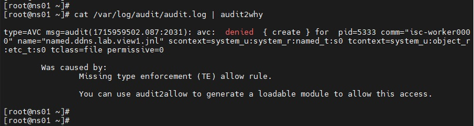

# Otus Homework 12. SELinux
### Цель домашнего задания
Тренировка умения работать с SELinux: диагностировать проблемы и модифицировать политики SELinux для корректной работы приложений, если это требуется.
### Описание домашнего задания

1. Запустить nginx на нестандартном порту 3-мя разными способами:
- переключатели setsebool;
- добавление нестандартного порта в имеющийся тип;
- формирование и установка модуля SELinux.

2. Обеспечить работоспособность приложения при включенном selinux.
- развернуть приложенный стенд https://github.com/mbfx/otus-linux-adm/tree/master/selinux_dns_problems;
- выяснить причину неработоспособности механизма обновления зоны (см. README);
- предложить решение для данной проблемы;
- выбрать одно из решений для реализации, предварительно обосновав выбор;
- реализовать выбранное решение и продемонстрировать его работоспособность.

## Выполнение
### Запустить nginx на нестандартном порту 3-мя разными способами
С помощью *Vagrant* создаем виртуальную машину.
```
# -*- mode: ruby -*-
# vim: set ft=ruby :


MACHINES = {
  :selinux => {
        :box_name => "centos/7",
        :box_version => "2004.01",       
  },
}

Vagrant.configure("2") do |config|

  MACHINES.each do |boxname, boxconfig|

      config.vm.define boxname do |box|

        box.vm.box = boxconfig[:box_name]
        box.vm.box_version = boxconfig[:box_version]

        box.vm.host_name = "selinux"
        box.vm.network "forwarded_port", guest: 4881, host: 4881

        box.vm.provider :virtualbox do |vb|
              vb.customize ["modifyvm", :id, "--memory", "1024"]
              needsController = false
        end

        box.vm.provision "shell", inline: <<-SHELL
          yum install -y epel-release
          yum install -y nginx
          sed -ie 's/:80/:4881/g' /etc/nginx/nginx.conf
          sed -i 's/listen       80;/listen       4881;/' /etc/nginx/nginx.conf
          systemctl start nginx
          systemctl status nginx
          ss -tlpn | grep 4881
        SHELL
    end
  end
end
```

Результатом выполнения команды *vagrant up* будет виртуальная машина с установленным *nginx*, работающим на 4881 порту и рабоютающим *SELinux*. Порт проброшен в хостовую ОС.

### Обеспечить работоспособность приложения при включенном selinux
На хост с устарновленным *ansible* клонируем репозиторий и переходим в нужный каталог:
```bash
git clone https://github.com/mbfx/otus-linux-adm.git
cd otus-linux-adm/selinux_dns_problems
```
Создаем стенд командой *vagrant up*. Результатом работы команды будет две созданные виртуальные машины: сервер с IP-адресом 192.168.50.10 и клиент с IP-адресом 192.168.50.15

```bash
vagrant status
Current machine states:

ns01                      running (virtualbox)
client                    running (virtualbox)
```
Попробуем внести изменения, введя команду
```
nsupdate -k /etc/named.zonetransfer.key
```
Но получаем ошибку **update failed: SERVFAIL**  
  
Команда `cat /var/log/audit/audit.log | audit2why` ничего не показывает, следовательно ошибок со стороны клиента нет. Выполним ту же команду на сервере.  
  

